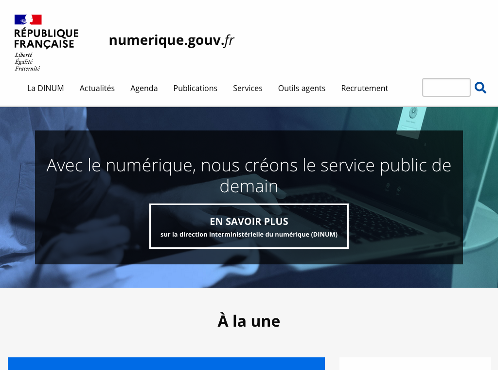
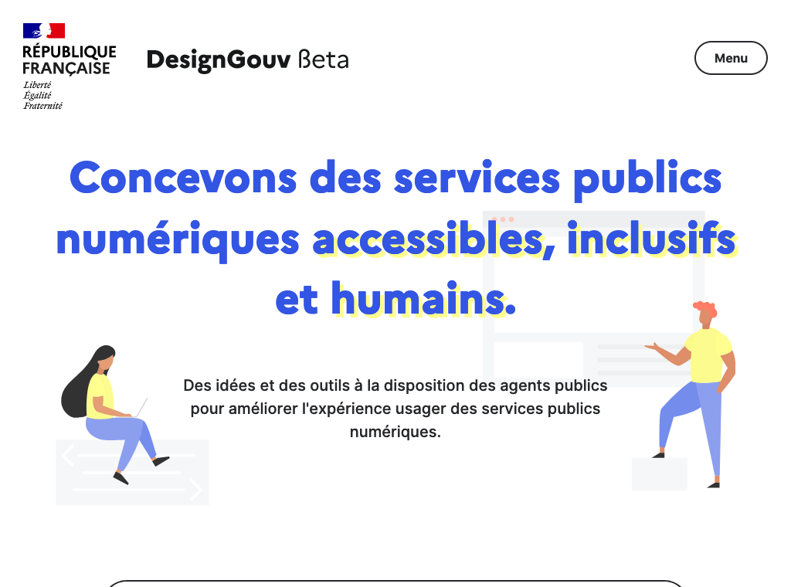
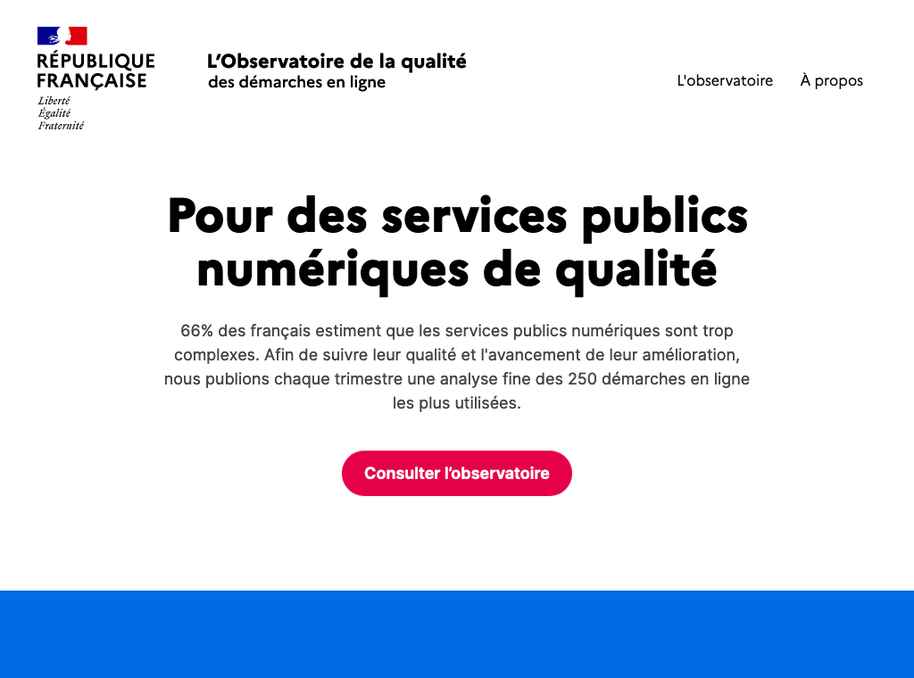
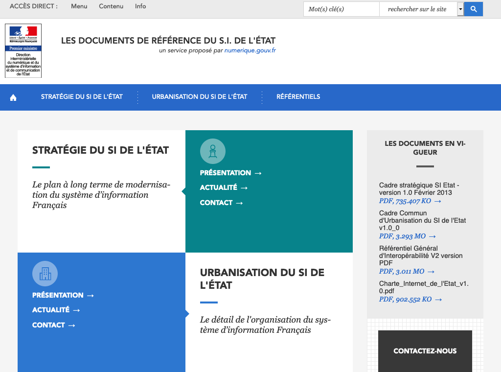
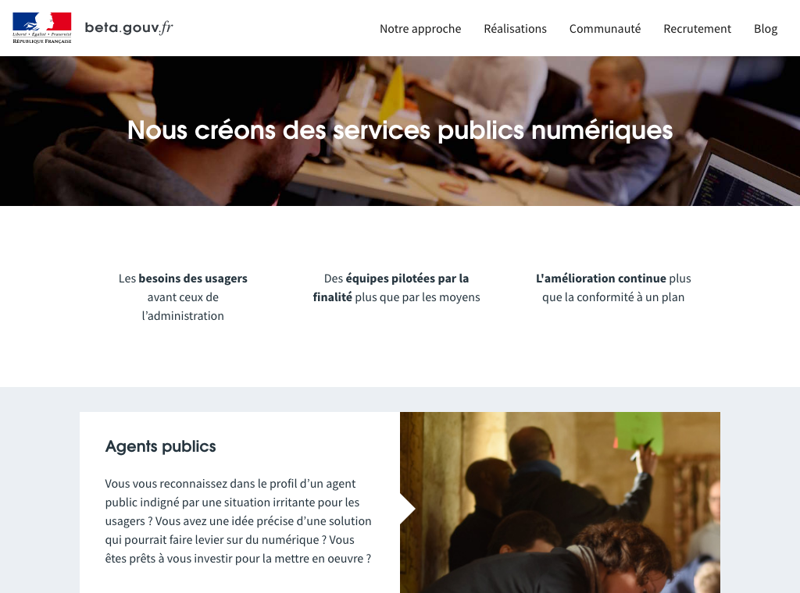
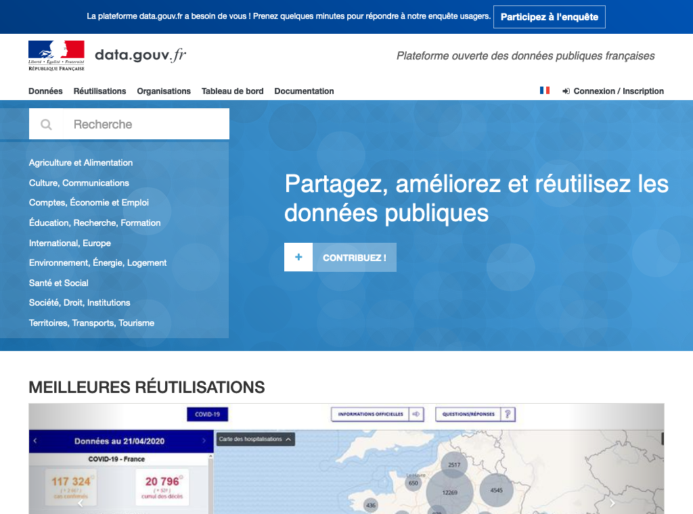
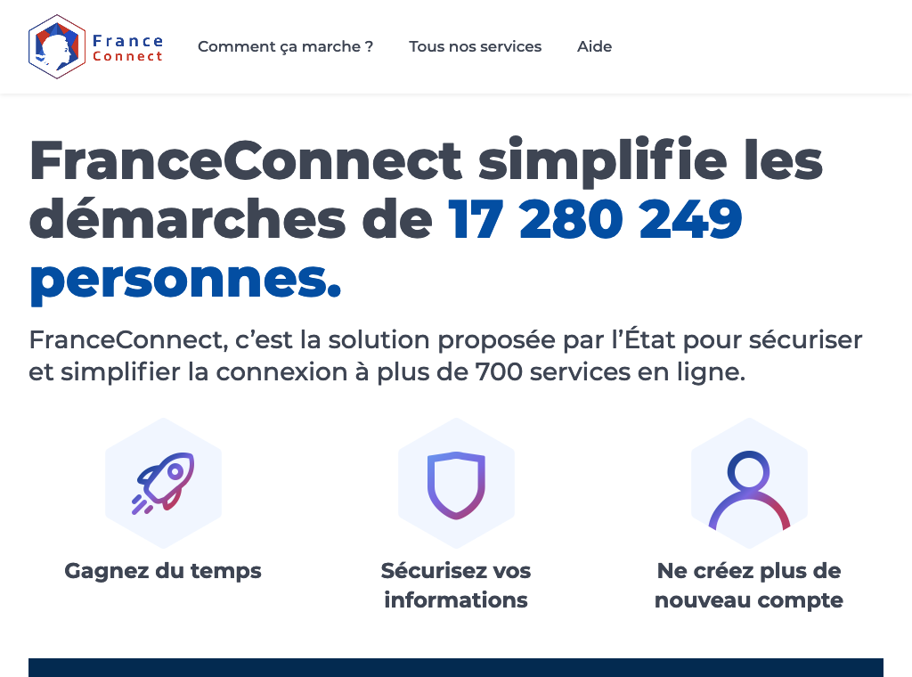
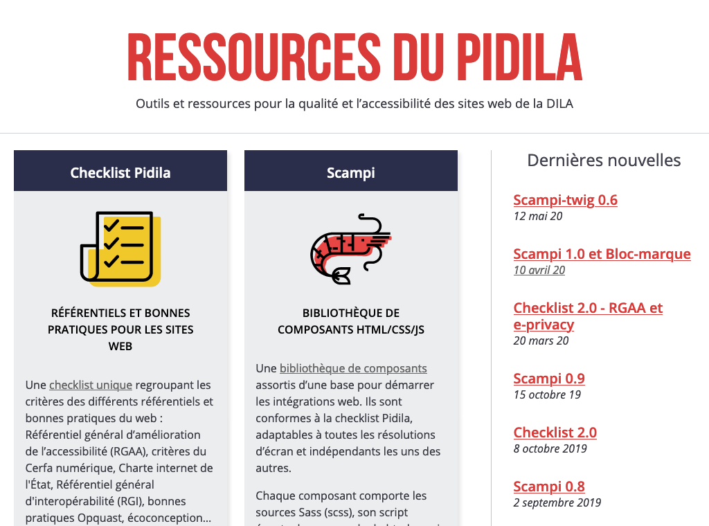

# France

## Identité Numérique pour les citoyens
Le service [FranceConnect](https://franceconnect.gouv.fr/) est le service de vérification de l'identité pour les citoyens.
Il agit comme un pont entre une porte identifiée et une autre en permettant un échange des données : l'identité d'un citoyen a été préalablement certifiée par A. B demande à A, via [FranceConnect](https://franceconnect.gouv.fr/), cette certification.
Ce service est limité à l'administration et s'étend à quelques rares cas d'entreprises privées, dans l'application stricte de la loi.

## Règles ou bonnes pratiques de construction de services numériques
### Conception des services
Le site numerique.gouv.fr, via la mission tech.gouv et le site design.numerique.gouv.fr proposent tous les deux des accompagnements humains pour les administrations ayant à construire des services numériques.
Le service [Betagouv](https://beta.gouv.fr/) est un programme de conception de services publics numériques. Une série de vidéos permet aux agents de concevoir selon une méthodologie centrée utilisateur.

### UX
Le site comment-faire.modernisation.gouv.fr propose des outils et méthodologie de conception centrée utilisateur.

### Doctrine sur les données connues de l'administration
Un décret encadre les droits et obligations de partage de données entre administrations pour la simplification des démarches. Ce cadre légale est rappelé en tant que ressource sur https://references.modernisation.gouv.fr/.
Un rappel de cette loi et de ressources pour accéder à des données partagées est présente sur le site numerique.gouv.fr
[L'observatoire du numérique](https://observatoire.numerique.gouv.fr/) est un indicateur d'avancées de la qualité des démarches administratives en ligne.

### Règles d'accessibilité
Les obligations légales sont présentes sur le site https://references.modernisation.gouv.fr/
Pidila est un site qui liste des outils à disposition des développeurs.
Design.numerique.gouv.fr rappelle les obligations tout en proposant des outils et une aide humaine pour cet aspect de la conception de services.

### Sécurité & tech
??

## Gestion des habilitations et exposition des données sensibles
Un service d'habilitation permet la sécurisation des échanges de données entre administration.
Le service api.gouv.fr expose les api conçues par les administrations.

## Données ouvertes
Le service [data.gouv.fr](https://data.gouv.fr/) expose toutes les données ouvertes de l'administration.

## Cibles adressées par les produits
design gouv > Agents publics
api gouv > Ministères, collectivités, entreprise privée
FC > Citoyens

## Inclusion & support
Tous les sites sont exclusivement en français.
Le formulaire ou l'adresse email sont le seul moyen de contact.
Les sites ont un comportement responsive.

## Identité graphique et aspect général
Il n'y a aucune cohérence graphique entre tous les sites mentionnés. Les extensions ne créent pas d'uniformité même si la majorité des sites utilisent l'extension .gouv.
Seuls api.gouv.fr et design.numerique.gouv.fr intègrent des illustrations.
numerique.gouv.fr utilise beaucoup de photographies issues de banque d'image.
La vidéo est peu présente.

## Schéma de l'écosystème
Légende du tableau : 
- Identité Numérique pour les citoyens :bust_in_silhouette:
- Règles ou bonnes pratiques de construction de services numériques :beginner:
- Gestion des habilitations et exposition des données sensibles :closed_lock_with_key:
- Données ouvertes :unlock:
- Sécurité et tech :bomb:
- Pilotage et plan de transformation :dart:

| Nom du service    |  Feature |  Cible | Capture | 
|-------------------|---|---|---|
| Numerique.gouv.fr | :beginner: :closed_lock_with_key: :dart: |   |   |
| design.numerique.gouv.fr            | :beginner: :dart: |  Agents publics |    |
| Observatoire      | :dart:  |   |  |
| Références        | :dart: |   | |
| api.gouv.fr          | :unlock: :closed_lock_with_key:   | Ministères, entreprises, collectivités  |  |
| beta.gouv.fr          | :beginner:  | Agents publics, décideurs publics  | |
| data.gouv.fr          | :unlock:  |   |  |
| FranceConnect.gouv.fr     | :bust_in_silhouette:  | Citoyens  | |
| Pidila           | :beginner:  | Développeurs  ||
| Comment faire     | :beginner:  |   |  