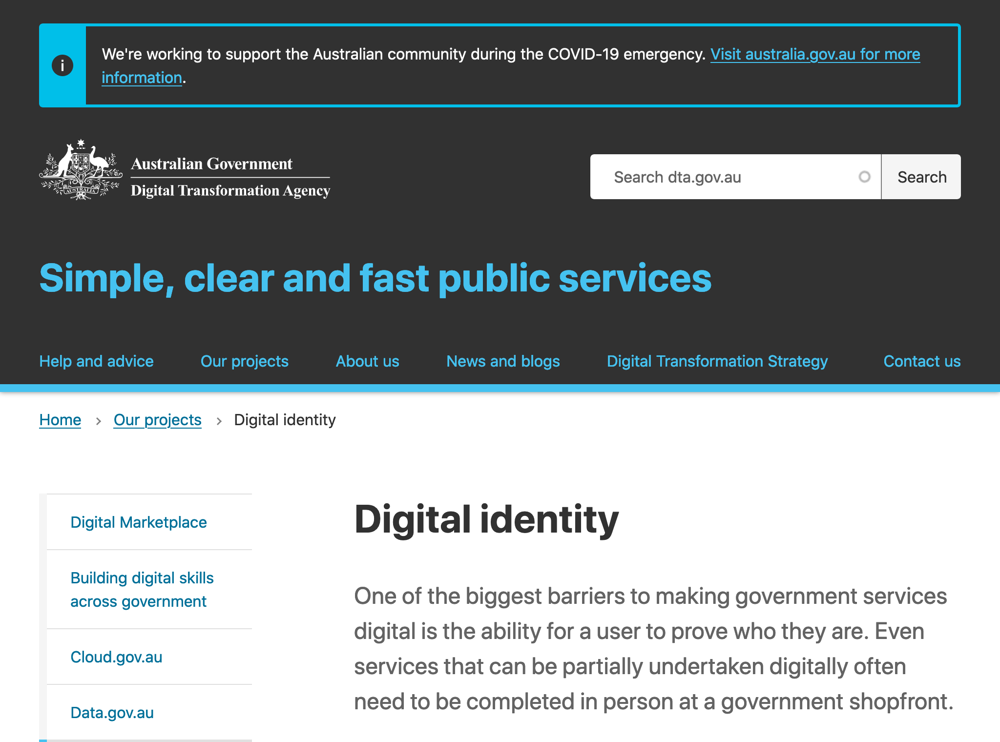
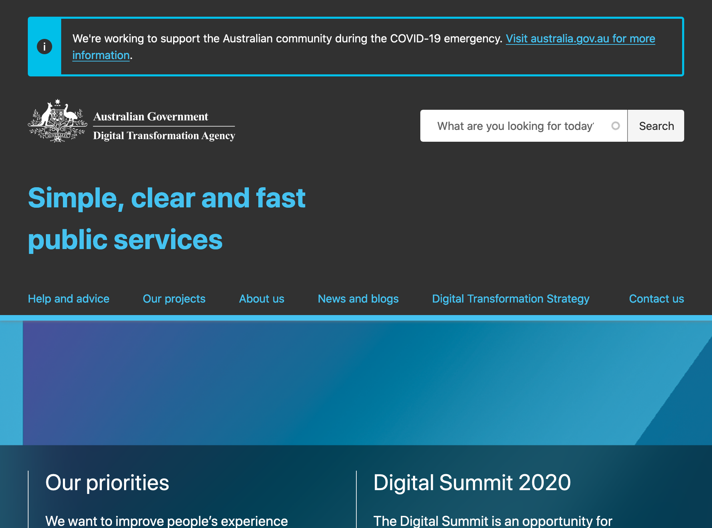
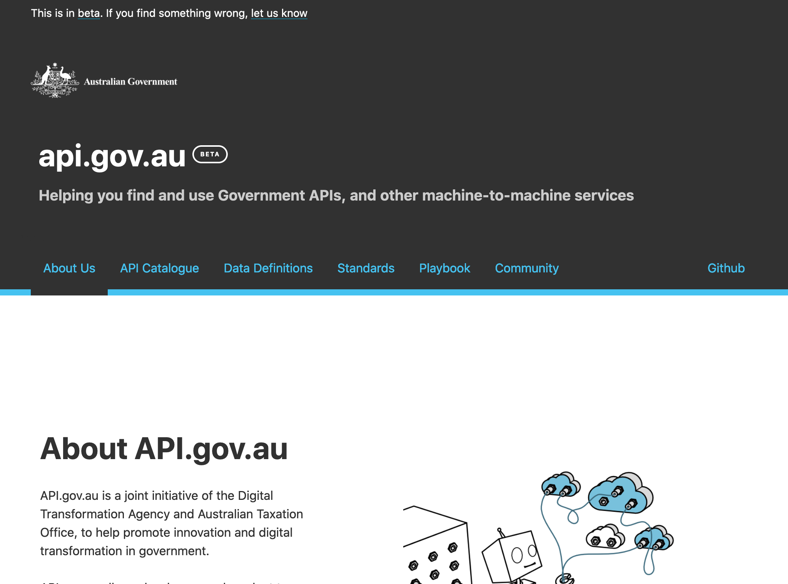

# Australie

## Identité Numérique 
L'agence pour la transformation digitale opère le travail en cours sur [l'identité digitale](https://www.dta.gov.au/our-projects/digital-identity).

## Règles ou bonnes pratiques de construction de services numériques
### Conception des services - Accessibilité - UX
[L'agence pour la transformation digitale](https://www.dta.gov.au/) documente et produit toutes les informations liées à la conception des services digitaux.
Elle est responsable de la [stratégie digitale](https://www.dta.gov.au/digital-transformation-strategy) du gouvernement et fixe les [standards de conception](https://www.dta.gov.au/help-and-advice/about-digital-service-standard).
Elle anime aussi une communauté de pratiques, est à l'origine d'événements en présentiels, tant pour les agents publics que pour fédérer des talents du numérique. 
Le site propose aussi tous les [services ou produits](https://www.dta.gov.au/our-projects) disponibles pour les agents ou leurs partenaires techniques.

### Doctrine sur les données connues de l'administration, exposition et habilitations
Le catalogue des api de l'administration est disponible sur [api gov](https://api.gov.au/). 
Une [documentation complète](https://api.gov.au/standards/national_api_standards/) liée aux standards de construction des API : les mots-clés utilisés par les API sont normés et permettent une recherche par mot-clé très performante.
Ce site est opéré par l'agence digitale de transformation et par le ["standard business reporting"](https://www.sbr.gov.au/), qui assure les relations entre gouvernement et entreprises privées.
Les habilitations aux données sensibles sont parfois payantes, la responsabilité des habilitations revient aux producteurs de données. 

### Données ouvertes
[Data gov](https://data.gov.au/) est le portail d'accès aux jeux de données ouvertes. 

### Cibles adressées par les produits
Les sites mentionnés s'adressent essentiellement à l'administration et aux entreprises privées travaillant pour l'administration.  

### Inclusion & support
Le formulaire de contact est souvent le seul moyen de joindre les équipes.

### Identité graphique et aspect général
Tous les sites réalisés par l'agence utilisent le même design system.

## Tableau de l'écosystème
Légende du tableau : 
- Identité Numérique pour les citoyens :bust_in_silhouette:
- Règles ou bonnes pratiques de construction de services numériques :beginner:
- Exposition & habilitations pour les données :closed_lock_with_key:
- Données ouvertes :unlock:
- Sécurité et tech :bomb:
- Pilotage et plan de transformation :dart:

| Nom du service    |  Feature |  Cible | Capture | 
|-------------------|---|---|---|
|[Identité digitale](https://www.dta.gov.au/our-projects/digital-identity) | :bust_in_silhouette: | Agents publics  |   |
|[Digital transformation agency](https://www.dta.gov.au) | :dart: :bomb: :beginner:|  Agents publics |    |
| [Api gov](https://api.gov.au/)  | :closed_lock_with_key:  | Agents publics  |  |
| [Data gov](https://data.gov.au/)        |  :unlock: :closed_lock_with_key: | Tous  | |
* * *

> awards des meilleurs sites publics dans le cadre d'événements, digital summit. Animation de groupe de travail > qui ? combien de personnes ? combien de temps ?