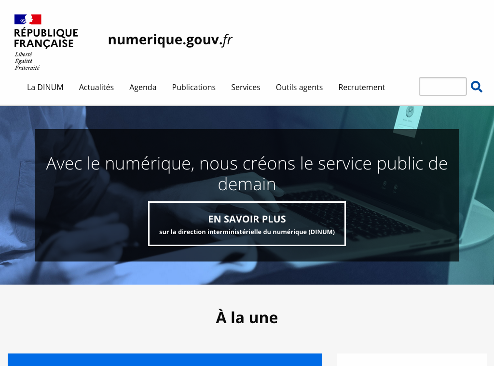
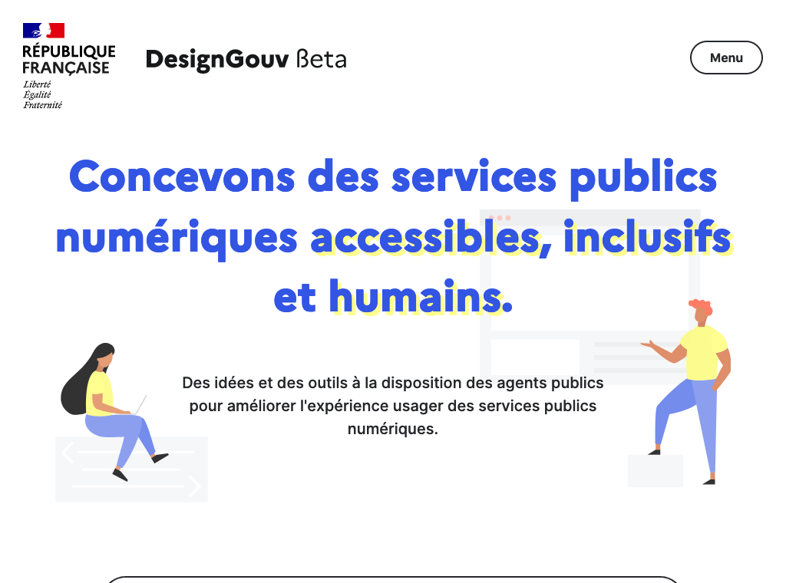
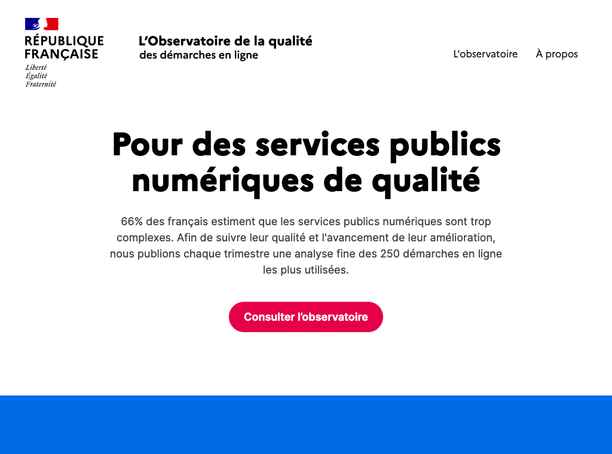
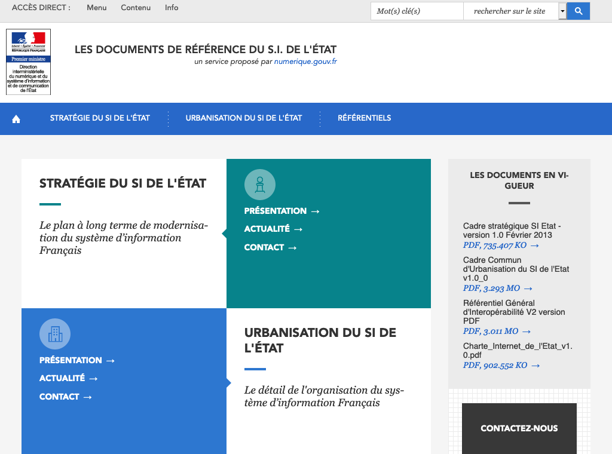
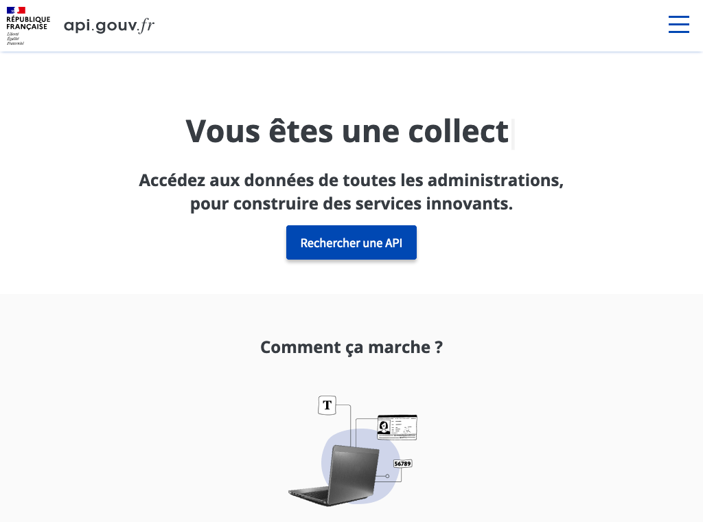
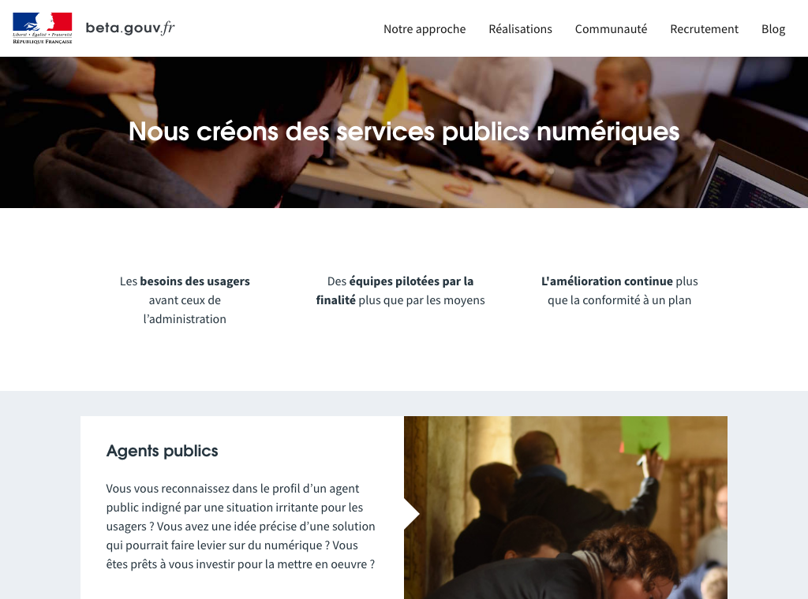
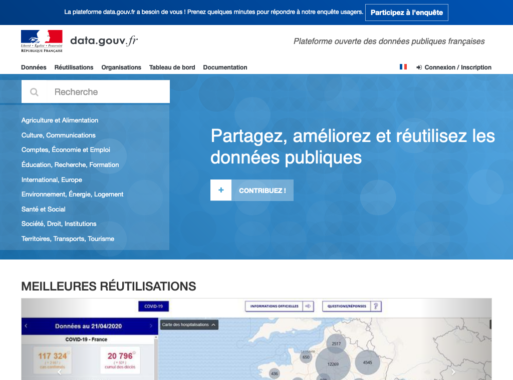
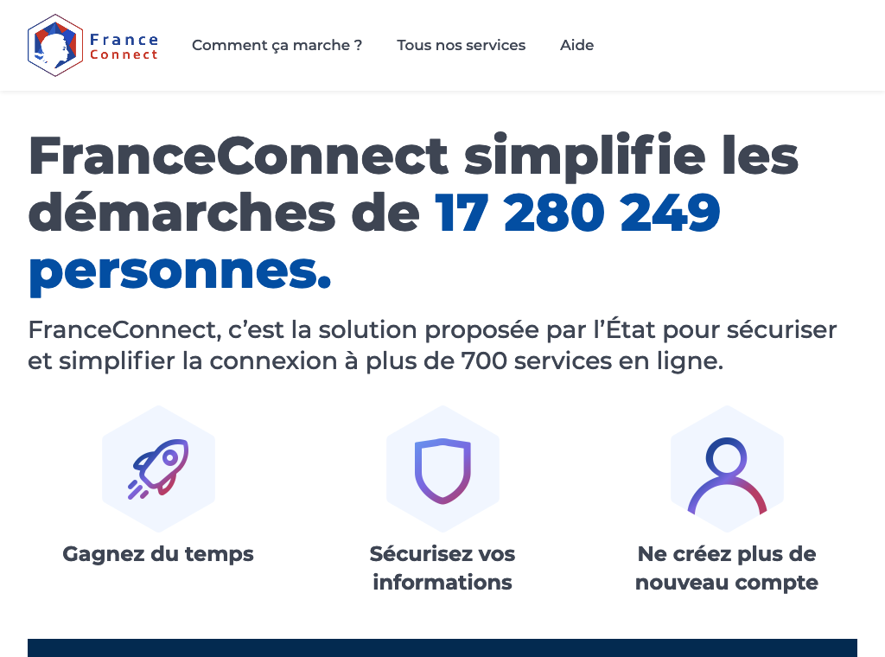
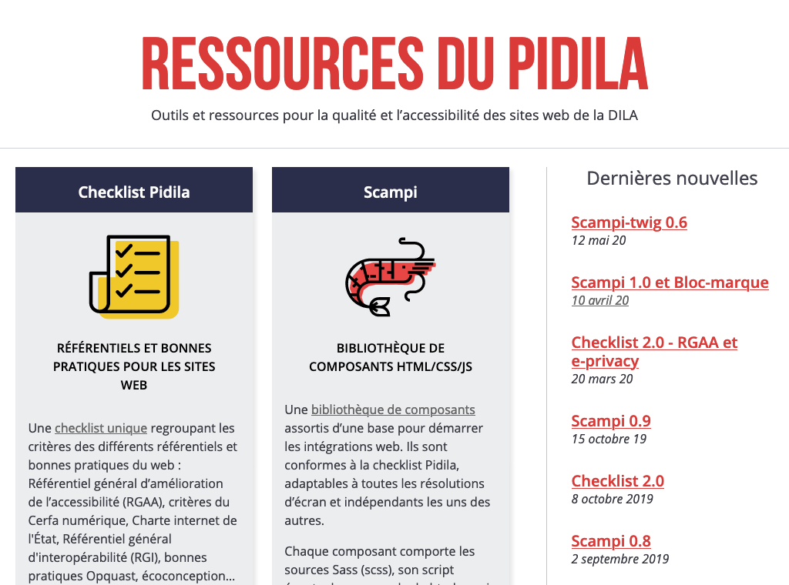
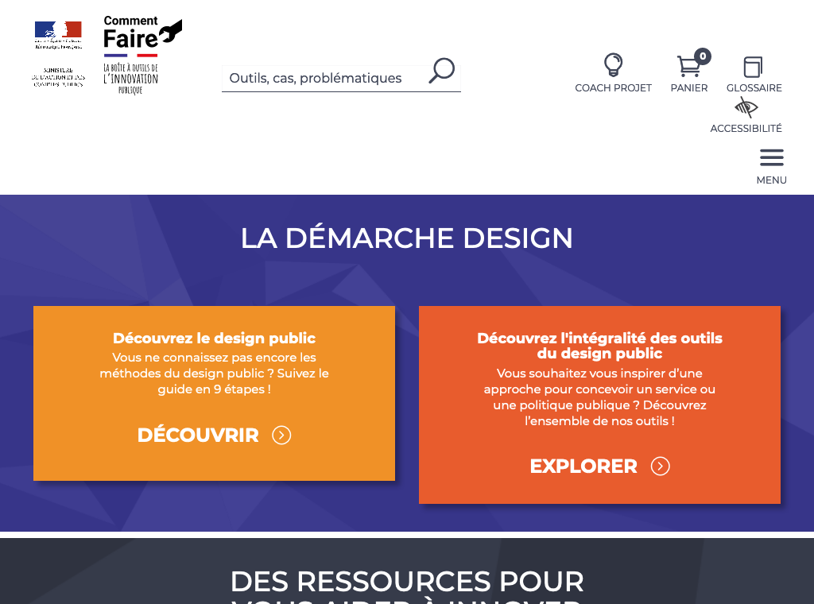

# France Ecosystème
Légende du tableau : 
- Identité Numérique pour les citoyens :bust_in_silhouette:
- Règles ou bonnes pratiques de construction de services numériques :beginner:
- Gestion des habilitations et exposition des données sensibles :closed_lock_with_key:
- Données ouvertes :unlock:
- Sécurité et tech :bomb:
- Pilotage et plan de transformation :dart:

| Nom du service    |  Feature |  Cible | Capture | 
|-------------------|---|---|---|
| Numerique.gouv.fr | :beginner: :closed_lock_with_key: :dart: |   |   |
| design.numerique.gouv.fr            | :beginner: :dart: |  Agents publics |    |
| Observatoire      | :dart:  |   |  |
| Références        | :dart: |   | |
| api.gouv.fr          | :unlock: :closed_lock_with_key:   | Ministères, entreprises, collectivités  |  |
| beta.gouv.fr          | :beginner:  | Agents publics, décideurs publics  | |
| data.gouv.fr          | :unlock:  |   |  |
| FranceConnect.gouv.fr     | :bust_in_silhouette:  | Citoyens  | |
| Pidila           | :beginner:  | Développeurs  ||
| Comment faire     | :beginner:  |   |  