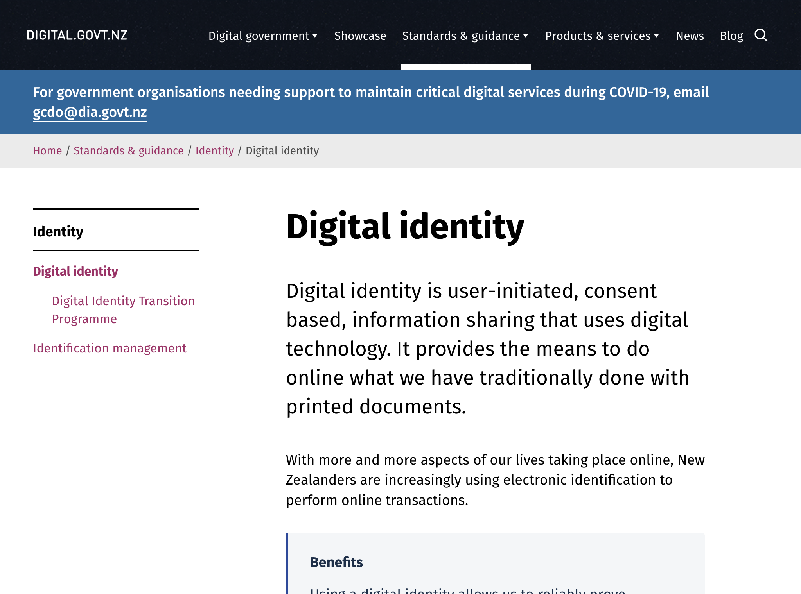
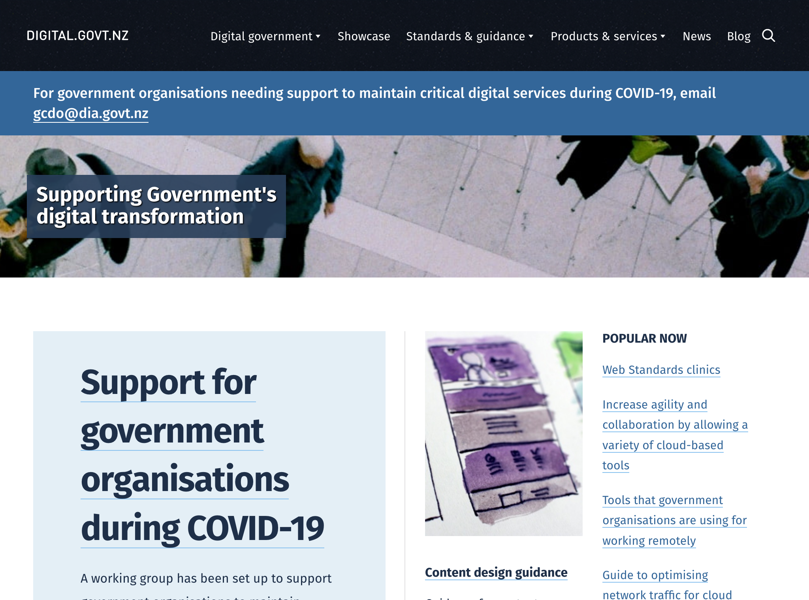
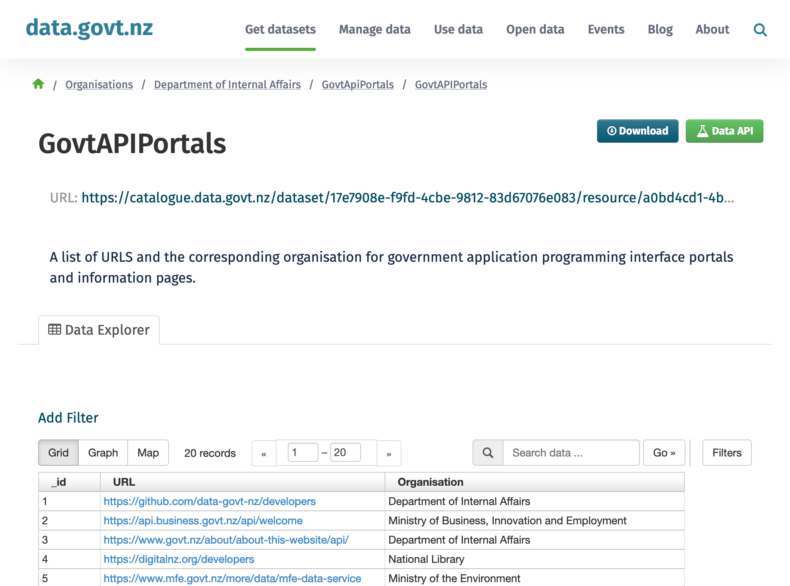
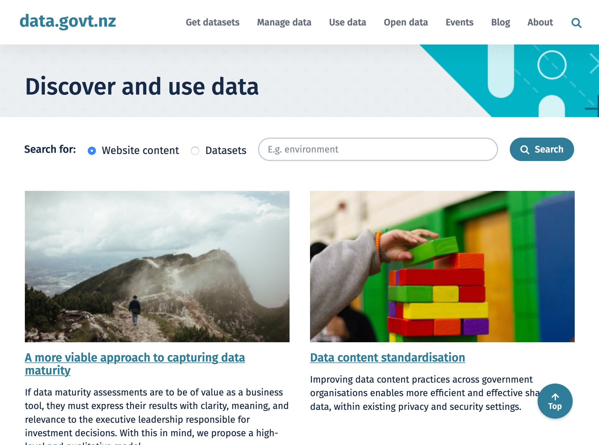

# Nouvelle-Zélande

## Identité Numérique 
Le gouvernement finance en ce moment la [recherche sur l'identité digitale](https://www.digital.govt.nz/standards-and-guidance/identity/digital-identity/). Il n'existe pas de service d'identification opéré par l'Etat. Des bonnes pratiques de sécurité concernant l'identification sur les services numériques est largement documentée sur ce site et explicite de façon très pédagogique les principes de doubles facteurs de vérification, de gestion des risques, etc. 
Chaque ministère semble donc avoir un identifiant propre : myMSD pour les questions d'emploi ; myIR pour les questions de fiscalité.

## Règles ou bonnes pratiques de construction de services numériques
### Conception des services - Accessibilité - UX
[L'agence digitale du gouvernement](https://www.digital.govt.nz/) documente et produit toutes les informations liées à la conception des services digitaux :
- elle publie les axes de travail et la [stratégie digitale](https://www.digital.govt.nz/digital-government/) du gouvernement 
- elle fixe les [standards de conception](https://www.digital.govt.nz/standards-and-guidance/) (parcours utilisateur, sécurité, framework technique) et intègre la réflexion sur l'utilisation des données
- elle propose une [offre de services](https://www.digital.govt.nz/products-and-services/) à disposition des administrations, produits par elle ou par des entreprises privées.
- la liste intégrale des sites de l'administration

### Doctrine sur les données connues de l'administration, exposition et habilitations
Dans le cycle de conception de nouveaux services numériques, l'agence digitale inclut donc la [réflexion sur les data](https://data.govt.nz/manage-data/) qui vont être produites et prépare déjà à la collecte, la gestion et le partage de ces données. 
Il ne semble pas y avoir de solution généralisée pour le partage de données confidentielles : elles se font sur les sites des producteurs qui gèrent eux-mêmes les habilitations. Ces ressources sont [listés sur le portail des données ouvertes](https://catalogue.data.govt.nz/dataset/govtapiportals/resource/a0bd4cd1-4bdb-4562-aafc-f3e185521e21).

### Données ouvertes
Toutes ces données, ces pratiques de collecte, de partage et d'utilisation de la donées sont accessibles sur [data.govt.nz](https://data.govt.nz/), qui est aussi le catalogue des données. 

### Cibles adressées par les produits
Les sites mentionnés s'adressent essentiellement à l'administration. 

### Inclusion & support
Adresse, email et réseaux sociaux sont disponibles pour entrer en contact avec l'agence. 
Une grande part est faite à l'intégration des populations locales dans la construction des services. 

### Identité graphique et aspect général
Les sites ont un code couleur propre mais une identité qu'on repère comme homogène.

## Tableau de l'écosystème
Légende du tableau : 
- Identité Numérique pour les citoyens :bust_in_silhouette:
- Règles ou bonnes pratiques de construction de services numériques :beginner:
- Exposition & habilitations pour les données :closed_lock_with_key:
- Données ouvertes :unlock:
- Sécurité et tech :bomb:
- Pilotage et plan de transformation :dart:

| Nom du service    |  Feature |  Cible | Capture | 
|-------------------|---|---|---|
|[Recherche sur l'identité digitale](https://www.digital.govt.nz/standards-and-guidance/identity/digital-identity/) | :bust_in_silhouette: | Agents publics  |   |
|[NZ digital government](https://www.digital.govt.nz/) | :dart: :bomb: :beginner:|  Agents publics |    |
| [Governement api portal](https://catalogue.data.govt.nz/dataset/govtapiportals/resource/a0bd4cd1-4bdb-4562-aafc-f3e185521e21) | :closed_lock_with_key:  | Agents publics  |  |
| [Datagovt](https://www.data.govt.nz/)        |  :unlock: :closed_lock_with_key: | Agents publics  | |
* * *

> est-ce que l'agence essaie d'englober les données confidentielles ?
> 
> note : il existe une api de contenu dispo sur le site du gouvernement