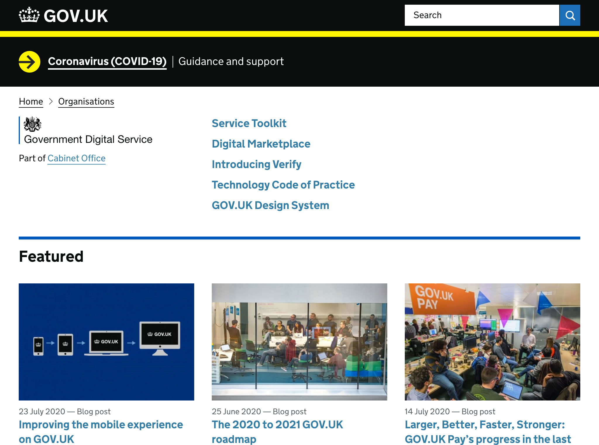

# Royaume-Uni

## Identité Numérique pour les citoyens
Le service [Gov UK Verify](https://www.verify.service.gov.uk/) est le service de vérification de l'identité pour les citoyens.
Le site associé à ce service s'adresse aux organismes souhaitant mettre en place l'identification : la documentation insiste sur les aspects liés au parcours utilisateur. 

## Règles ou bonnes pratiques de construction de services numériques
### Conception des services - Accessibilité - UX
L'agence GDS a mis en place des règles de conception de service très poussée, tant en terme de méthodes que d'outils mis à disposition de l'administration. Il assure aussi la qualité des services en exercant un droit de regard sur tous les services publics produits par les différentes administrations ou ministères. Les résiltats de la recherche de l'agence sont mis à disposition de tous.
GDS est aussi à l'origine de partage de pratiques au niveau international en fédérant une communauté de designers travaillant pour des gouvernements ou organisations. 

### Doctrine sur les données connues de l'administration, exposition et habilitations
Un [service d'échange sécurisé](https://www.gov.uk/government/publications/secure-data-exchange-service-service-availability-and-issues/secure-data-exchange-service-sdes-service-availability-and-issues) existe au sein du ministère des taxes & revenus et encadre les habilitations. 
Si le "Personal Data Exchange" semble avoir été exploré au sein de GDS, il n'existe pas à ce jour de service lié à un échange de donnée plus généralisé que le service mentionné plus haut. 

## Données ouvertes
[Data gov](https://data.gov.uk/) recence toutes les données ouvertes de l'administration. Le prisme de la construction de service y est affiché dès la baseline. Les données sont disponibles via des jeux de données ou via une API. GDS (governement digital service) opère le système. 

## Cibles adressées par les produits
Les produits s'adressent quasi exclusivement à l'administration. 

## Inclusion & support
Les avancées en terme de service design du Royaume-Uni assure permettent la conception de services très inclusifs. Des formulaires de contacts guidés et des adresses emails permettent les mises en relation.  

## Identité graphique et aspect général
Tous les sites suivent l'identité proposée par le design system de GDS.
Vidéo explicative pour les sujets citoyens / agents publics (verify uk)

## Schéma de l'écosystème
Légende du tableau : 
- Identité Numérique pour les citoyens :bust_in_silhouette:
- Règles ou bonnes pratiques de construction de services numériques :beginner:
- Exposition & habilitations pour les données :closed_lock_with_key:
- Données ouvertes :unlock:
- Sécurité et tech :bomb:
- Pilotage et plan de transformation :dart:

| Nom du service    |  Feature |  Cible | Capture | 
|-------------------|---|---|---|
| [Gov UK Verify](https://www.verify.service.gov.uk/) | :bust_in_silhouette: | Agents publics  |   |
| [GDS](https://www.gov.uk/government/organisations/government-digital-service)           | :beginner: :bomb:|  Agents publics |    |
| [Data gov](https://data.gov.uk/)         | :unlock:  |   Agents publics et société civile|  |
| [service d'échange sécurisé](https://www.gov.uk/government/publications/secure-data-exchange-service-service-availability-and-issues/secure-data-exchange-service-sdes-service-availability-and-issues)     | :closed_lock_with_key:  |   Agents publics |  |

* * *

> Quel est le plan de transformation ? le cadre légal ? quelles avancées sur les échanges de données entre admin ?
> 
> API de contenu permet une énorme homogénéisation : les bonnes pratiques design reprennent par exemple tout le contenu de verify UK grâce à [cette API](https://content-api.publishing.service.gov.uk/#gov-uk-content-api)
> 
> Quelles informations disponibles pour les entreprises ?