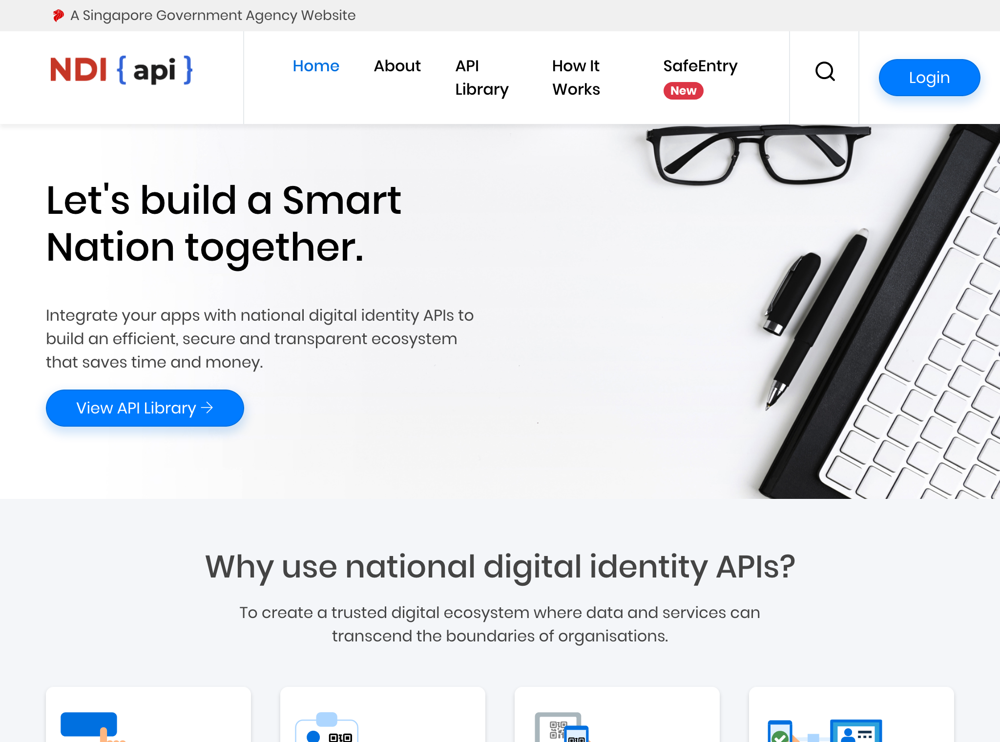
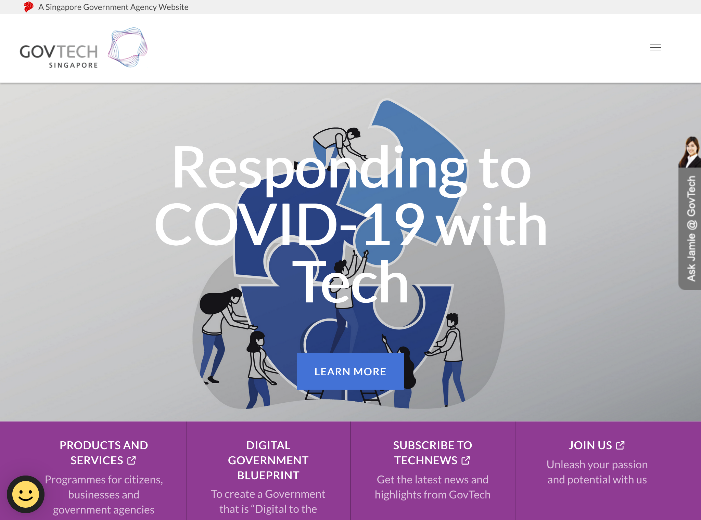
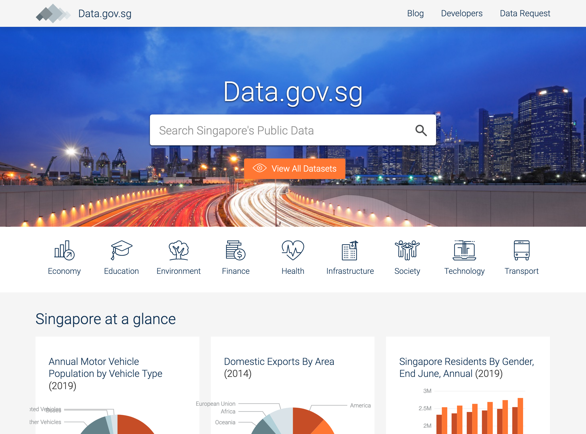

# Singapour

## Identité Numérique 
Le gouvernement de Singapour a une offre d'identification au niveau national très riche, qui s'appuie notamment sur des données biométriques. 

Le processus est différent selon qu'il s'agit de citoyens ([SingPass](https://www.singpass.gov.sg/spauth/login/loginpage?URL=%2F&TAM_OP=login)), de professionnels ou associations ([CorpPass](https://www.corppass.gov.sg/cpauth/login/homepage?TAM_OP=login)).

Le site [Ndi-API](https://www.ndi-api.gov.sg/) est le portail pour les entreprises qui souhaitent mettre utiliser ces services pour leurs utilisateurs. 
L'implémentation est guidée par des bonnes pratiques de parcours, qui semblent valider l'habilitation aux API d'identification.
Le CorpPass repose sur l'identification d'un administrateur de l'entité, lui-même identifié par le SingPass.

Enfin, une surcouche au SingPass permet à l'utilisateur de sélectionner les informations qu'il décide de partager à une entreprise privée : il s'agit de [SgId](https://id.gov.sg/).

## Règles ou bonnes pratiques de construction de services numériques
### Conception des services - Accessibilité - UX
[GovTech](https://www.tech.gov.sg/) est l'agence dgitale gouvernementale qui détermine toutes les bonnes pratiques en terme de parcours, de conception technique et même de produits utilisés. 
Elle est à l'origine de tous les produits qui facilitent la vie des l'administrations : vérification d'idenité, formulaires en ligne, etc. 
Chaque produit possède son propre site vitrine, qui détermine à son tour les règles d'une bonne utilisation / implémentation. 
Ces produits sont présentés de façon éditorialisés sur [Govtech](https://www.tech.gov.sg/products-and-services/?utm_source=hero_banner) et également sur le site [OpenGov](https://open.gov.sg/)

### Doctrine sur les données connues de l'administration, exposition et habilitations
[GovTech](https://www.tech.gov.sg/) donne la vision stratégique, assure le déploiement de cette vision, donne ses preuves d'impact et anime une communauté de pratique.
Le partage entre administration n'est pas visible mais semble être pratiqué par défaut dans les conceptions de l'agence.

## Données ouvertes
Les données ouvertes sont disponibles sur [DataGov](https://data.gov.sg/).

## Cibles adressées par les produits
Les produits s'adresent aux citoyens et aux entreprises privées et aux professionnels du digital. L'agence fait beaucoup d'effort de communication sur son site. 

## Inclusion & support
Tous les sites possèdent un formulaire de contact et un chat(bot ?) en ligne. L'agence est également disponible en physique, par email, par téléphone. 

## Identité graphique et aspect général
Il n'y a pas d'homogénéité graphique strictes mais les sites directement réalisés par govtech ont une iddentité propre. 
Les illustrations sont fréquentes et on ressent une vraie modernité dans les choix UI.

## Tableau de l'écosystème
Légende du tableau : 
- Identité Numérique pour les citoyens :bust_in_silhouette:
- Règles ou bonnes pratiques de construction de services numériques :beginner:
- Exposition & habilitations pour les données :closed_lock_with_key:
- Données ouvertes :unlock:
- Sécurité et tech :bomb:
- Pilotage et plan de transformation :dart:

| Nom du service    |  Feature |  Cible | Capture | 
|-------------------|---|---|---|
| [Ndi-API](https://www.ndi-api.gov.sg/) | :bust_in_silhouette: | Professionnels  |   |
|[GovTech](https://www.tech.gov.sg/) | :dart: :bomb: :beginner:|  Tous |    |
| [OpenGov](https://open.gov.sg/) | :beginner:  | Tous  |  |
| [Datagov](https://data.gov.sg/)        |  :unlock: :closed_lock_with_key: | Tous  | |
* * *
