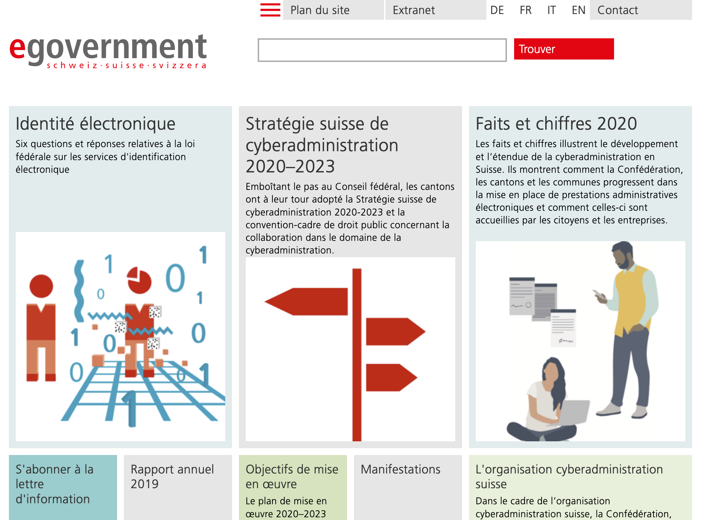
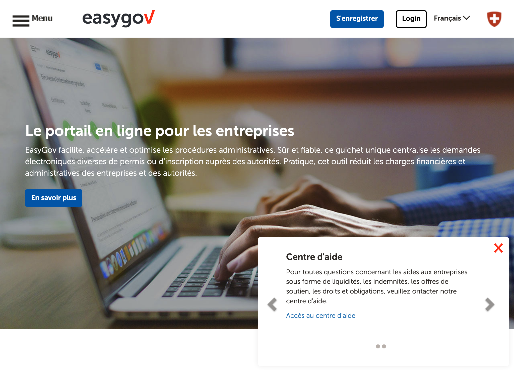
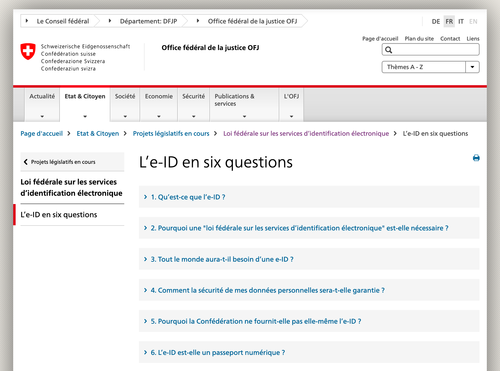
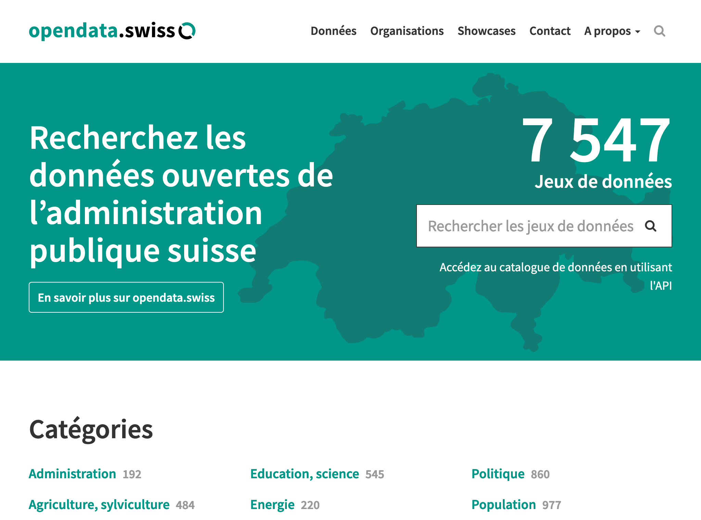

# Suisse

## Identité Numérique pour les citoyens
Le service d'identification est l'[e-ID](https://www.bj.admin.ch/bj/fr/home/staat/gesetzgebung/e-id.html). La loi encadre l'identité numérique mais la mise en oeuvre en est assurée par les entreprises privées. 

## Règles ou bonnes pratiques de construction de services numériques
### Conception des services
Le site de l'[e-governement](https://www.egovernment.ch/fr/dokumentation/trends-in-der-digitalisierung/) affiche toutes les informations liées aux activités de l'administration en ligne et donne les domaines dans lesquels les innovations ont lieu.
Les documents visibles traitent plus de problématiques techniques et ingénierales que de démarches de conception centrée utilisateur. 

### UX
non visible

### Doctrine sur les données connues de l'administration
Le fait de ne plus demander de données connues est intégré dans l'offre globale à destination des entreprises, qui semble être plus avancée que celle pour les citoyens.
https://www.easygov.swiss

Pour le reste des démarches, le [processus est en cours de déploiement](https://www.egovernment.ch/fr/umsetzung/schwerpunktplan/promouvoir-les-plateformes-dechange-de-donnees-de-ladministr/) au sein des administrations, surtout dans le cadre de groupes de travail. La DSI de l'Etat coordonne les travaux. Les données sont accessible via une plateforme intranet exclusivement.

### Règles d'accessibilité
non visible

### Sécurité & tech
non visible

## Gestion des habilitations et exposition des données sensibles
non visible

## Données ouvertes
[Open Data](https://opendata.swiss/fr/) est la plateforme des données ouvertes de l'administration. Les données sont accessibles via une API ou via des jeux de données. Le site propose une cartographie assez complète 

## Cibles adressées par les produits
Programme d'e-gouvernement qui s'adresse à tous les stades de l'administration : confédération, cantons, villes.

## Inclusion & support
Sites aussi disponibles en anglais.
Formulaire de contact. Centre d'appel pour easygov.

## Identité graphique et aspect général
Vidéo explicatives très faciles à comprendre pour tous les éléments liés à l'administration en ligne à destination des entreprises et des citoyens. 
Identité du gouvernement utilisée sur le portail de la cyberadministration : le [design système](https://swiss.github.io/styleguide/en/) et toutes les guidelines sont disponibles librement. 
Les autres services ont une identité propre.

## Tableau de l'écosystème
Légende du tableau : 
- Identité Numérique pour les citoyens :bust_in_silhouette:
- Règles ou bonnes pratiques de construction de services numériques :beginner:
- Gestion des habilitations et exposition des données sensibles :closed_lock_with_key:
- Données ouvertes :unlock:
- Sécurité et tech :bomb:
- Pilotage et plan de transformation :dart:

| Nom du service    |  Feature |  Cible | Capture | 
|-------------------|---|---|---|
| E-Governement |  :dart: :bomb: :closed_lock_with_key: :beginner:|   |   |
| EasyGov pour les entreprises           | :beginner: :bust_in_silhouette:|  Entreprises |    |
| Identité numérique    | :bust_in_silhouette: :beginner: | Citoyens  | |
| [Open Data](https://opendata.swiss/fr/)          | :unlock:  | Société civile  | |

> En dehors des considérations techniques d'interopérabilité, quelles règles de parcours utilisateur ? Quelles compétences dans les équipes de la CSI ?