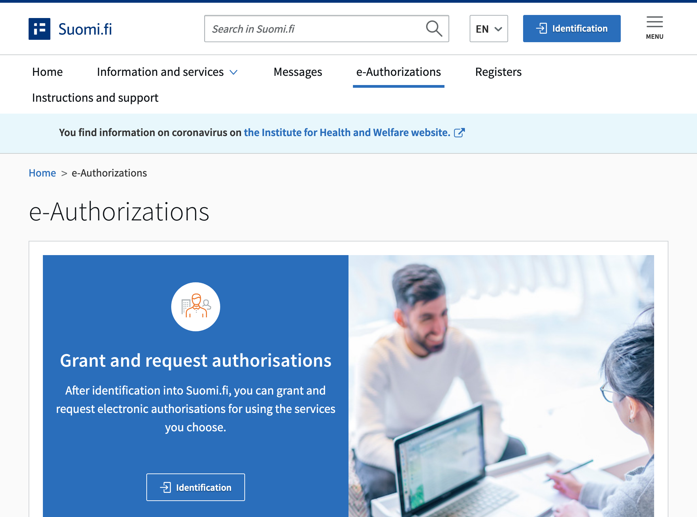
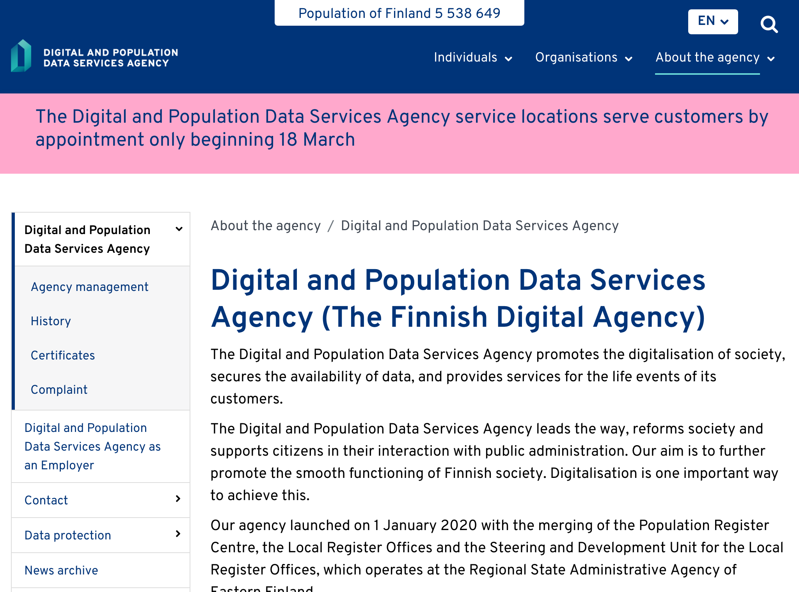
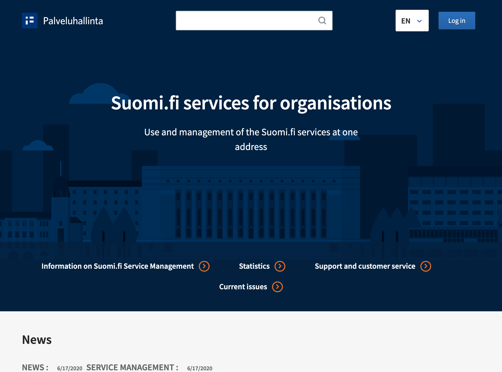
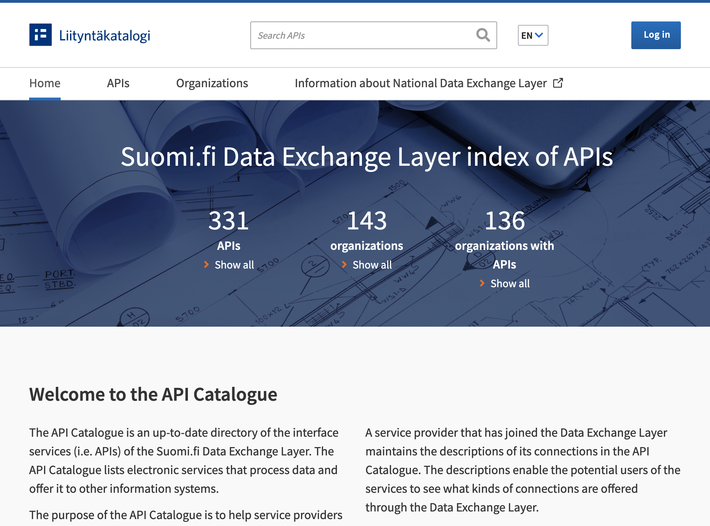
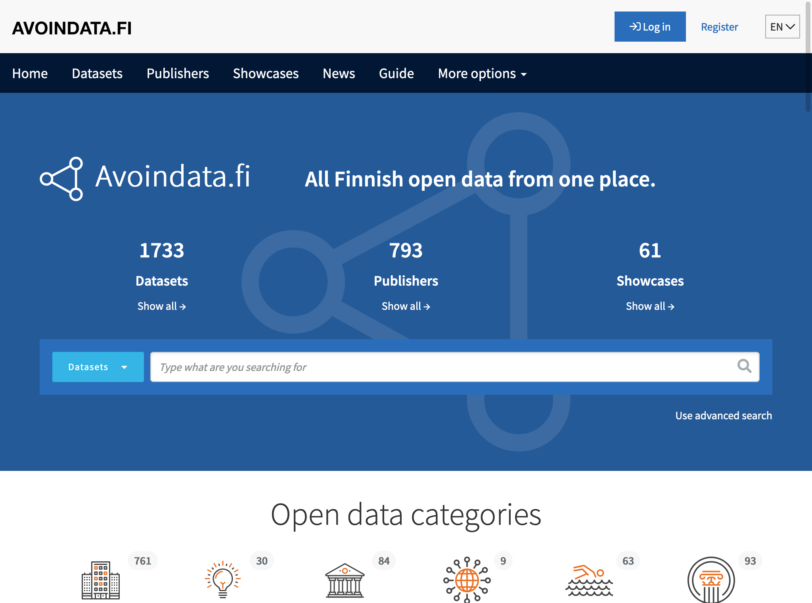

# Finlande

score DESI 2020 :
- global : 4
- utilisation de formulaires en ligne : 1
- "dlnuf" : 5
- dématerialisation : 9
- service aux entreprises : 16
- open data : 9
- ux & support : 5

## Identité Numérique pour les citoyens
Cet aspect est pris en charge sur le site du gouvernement [Suomi.fi](
https://www.suomi.fi/e-authorizations). L'identification se fait via des entreprises ou organisations tierces. Le citoyen peut également s'identifier grâce à une carte physique, sur les bornes d'accueil des établissements de service public. 
Ce service permet aussi l'identification en tant qu'entreprise ou organisation. 

## Règles ou bonnes pratiques de construction de services numériques
### Conception des services
L'intégralité de l'offre de service est promu sur [un seul service](https://palveluhallinta.suomi.fi/en) à destination des entreprises et organisations. 

### UX
Les bonnes pratiques en terme de parcours utilisateur est décrite sur ce catalogue de service pour chaque service (description, avantages, description technique, accès). Ces éléments sont produits par la [Digital and Population Data Services Agency](https://dvv.fi/en/digital-and-population-data-services-agency).

### Doctrine sur les données connues de l'administration
Les informations concernant les [échanges de données](https://palveluhallinta.suomi.fi/en/sivut/palveluvayla/esittely) entre administration est disponible sur ce site national.

### Règles d'accessibilité
Idem

### Sécurité & tech
idem

## Gestion des habilitations et exposition des données sensibles
La liste des API disponible est présentée sur [ce site](https://liityntakatalogi.suomi.fi/en_GB/).

## Données ouvertes
Les données ouvertes sont exposées sur le site [avoindata](https://www.avoindata.fi/en).

## Cibles adressées par les produits
Un guichet citoyen et entreprise présente les services en ligne et toutes les démarches administratives en ligne. 
L'agence digitale et le site suomi.fi est à destination des administrations.

## Inclusion & support
Tous les sites sont disponibles également en anglais.
L'agence digitale finlandaise agit comme portail pour les citoyens et proposent une aide en ligne, sur des lieux physiques. Elle propose également des formations gratuites et payantes à l'utilisation des services en ligne. 

## Identité graphique et aspect général
Les sites à destination des administrations ont tous la même identité.

## Tableau de l'écosystème
Légende du tableau : 
- Identité Numérique pour les citoyens :bust_in_silhouette:
- Règles ou bonnes pratiques de construction de services numériques :beginner:
- Gestion des habilitations et exposition des données sensibles :closed_lock_with_key:
- Données ouvertes :unlock:
- Sécurité et tech :bomb:
- Pilotage et plan de transformation :dart:

| Nom du service    |  Feature |  Cible | Capture | 
|-------------------|---|---|---|
| [Suomi.fi](https://www.suomi.fi/e-authorizations)        | :bust_in_silhouette:  | Citoyens |  |
| [Digital and Population Data Services Agency](https://dvv.fi/en/digital-and-population-data-services-agency) | :beginner: :bust_in_silhouette: | Citoyens et Entreprises  |   |
| [Palveluhallinta](https://palveluhallinta.suomi.fi/en)        | :dart: :bomb:| Administration  | |
| [Liityntakatalogi](https://liityntakatalogi.suomi.fi/en_GB/)         | :closed_lock_with_key: :beginner:  | Administration  |  |
| [Avoindata](https://www.avoindata.fi/en)        | :unlock:  |  Société civile |  |

* * *

> Comment l'agence digitale intervient-elle auprès des collectivités ? 
> 
> Est-elle exclusivement à l'origine du design des services et démarches ?
> 
> Quelle différence entre les données ouvertes du FSC (catalog) et celles du portail d'open data ?