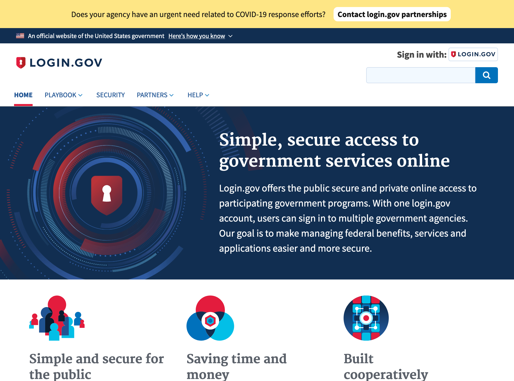
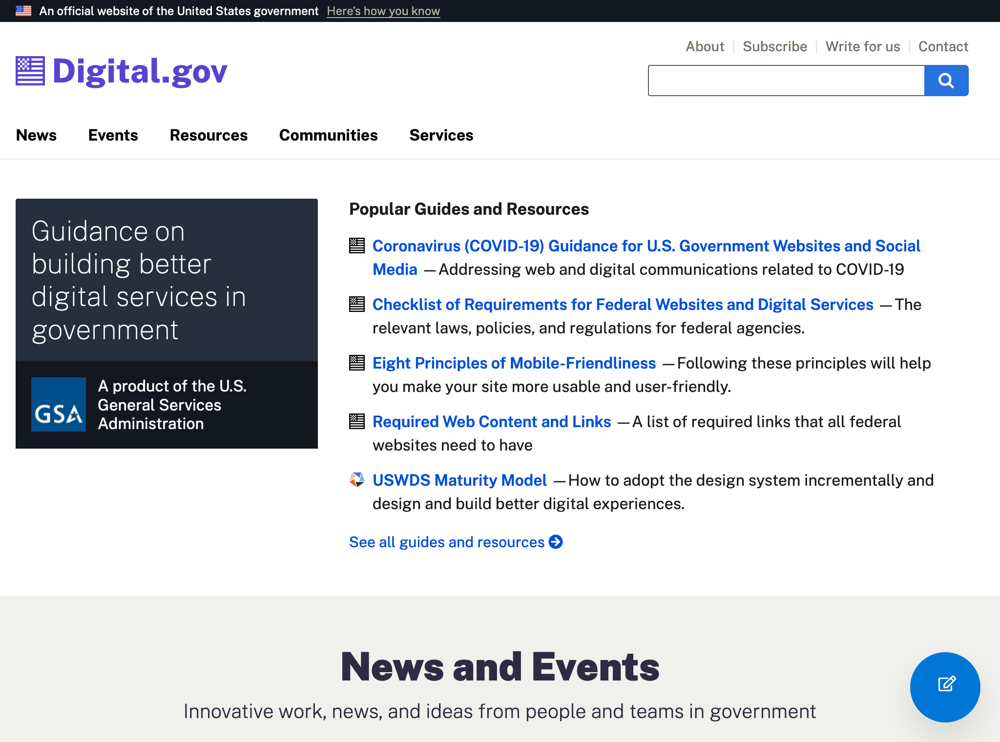
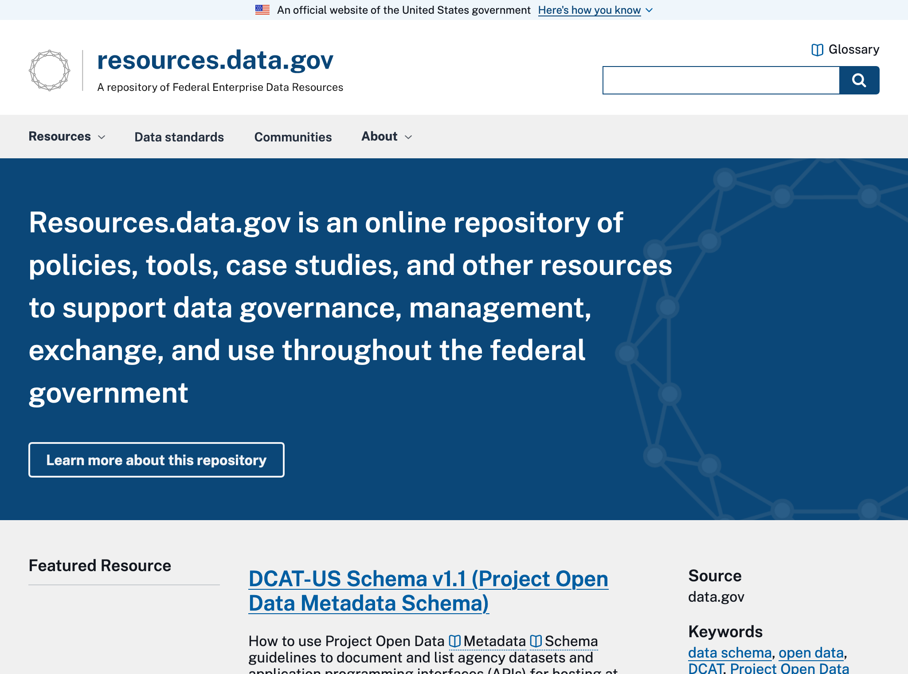
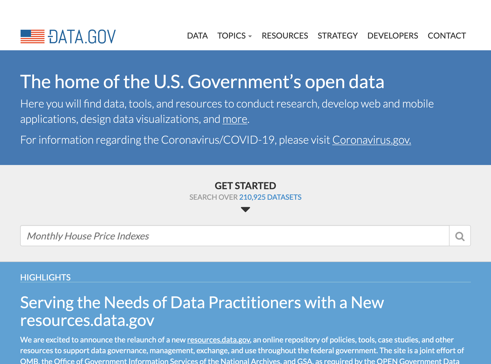
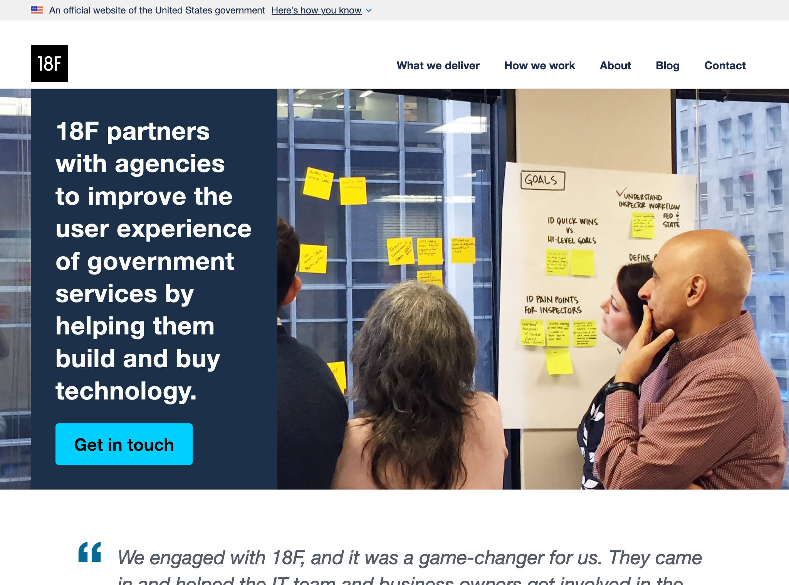

# USA

## Identité Numérique 
[Login.gov](https://login.gov/) est le dispositif d'identificaiton numérique pour les citoyens. Il est exclusivement à l'usage des administrations. L'habilitation à utiliser login.gov passe par un formulaire de demande, qui fait l'objet d'une étude personnalisée quant au bénéfice de l'utilisation de ce login. 
Ce service fait partie de l'offre de la [General Services Administration](https://www.gsa.gov/).

## Règles ou bonnes pratiques de construction de services numériques
### Conception des services - Accessibilité - UX
[Technology Transformation Services](https://www.gsa.gov/about-us/organization/federal-acquisition-service/technology-transformation-services) liste tous les portails, structures et produits à disposition de l'administration en terme de stratégie digitale. 

[l'Agence 18F](https://18f.gsa.gov/) réalise des projets innovants au sein de l'admnistration. 

[Digital Gov](https://digital.gov/) est l'agence digitale du gouvernement. 
L'agence regroupe également l'offre à disposition de l'administration, de façon plus actionnable. 
Elle aggrège également tout le contenu nécessaire à la conception d'un service numérique en terme de standards, sans pour autant qu'elle ait produit ou écrit ces contenus. Un élément graphique permet de connaître le producteur du contenu. L'agence fonctionne donc plutôt comme un guide de survie ou une cartographie face à l'offre pléthorique de ressources ou d'accompagnement. 

### Doctrine sur les données connues de l'administration, exposition et habilitations
[Resources data gov](https://resources.data.gov/)  présente la doctrine en terme de production, de gouvernance de la donnée. Elle propose aussi les standards techniques liés à la production de donneés. Enfin, des projets sont présentés sous la forme d'articles dans lesquels le rôle joué par la donnée dans la réussite du projets sont expliqués (réponse covid notamment).
On y parle autant de stratégie de production, de données ouvertes ou de données confidentielles. 

### Données ouvertes
[Data gov](https://www.data.gov/) est le portail d'accès aux jeux de données ouvertes.

[API gov](https://api.data.gov/), sous-domaine du site, permet d'accéder en un seul point à toutes les données. 

[Strategy Data](https://strategy.data.gov/), sous-domaine accessible via le menu principal, donne accès à la stratégie associée à l'open data.

### Cibles adressées par les produits
Les sites mentionnés s'adressent essentiellement à l'administration.  

### Inclusion & support
Le formulaire de contact est souvent le seul moyen de joindre les équipes.

### Identité graphique et aspect général
Tous les sites réalisés par l'agence utilisent le même design system.

## Tableau de l'écosystème
Légende du tableau : 
- Identité Numérique pour les citoyens :bust_in_silhouette:
- Règles ou bonnes pratiques de construction de services numériques :beginner:
- Exposition & habilitations pour les données :closed_lock_with_key:
- Données ouvertes :unlock:
- Sécurité et tech :bomb:
- Pilotage et plan de transformation :dart:

| Nom du service    |  Feature |  Cible | Capture | 
|-------------------|---|---|---|
|[Login.gov](https://login.gov/) | :bust_in_silhouette: | Citoyens & Agents publics  |   |
|[Digital Gov](https://digital.gov/) | :dart: :bomb: :beginner:|  Agents publics |    |
|[Resources data gov](https://resources.data.gov/) | :closed_lock_with_key: :dart: :bomb: | Agents publics  |  |
| [Data gov](https://www.data.gov/)       |  :unlock: | Tous  | |
| [18F](https://18f.gsa.gov/)       |  :beginner: | Agents publics  | |

* * *

> quelle est la genèse du search engine de digital.gov ?