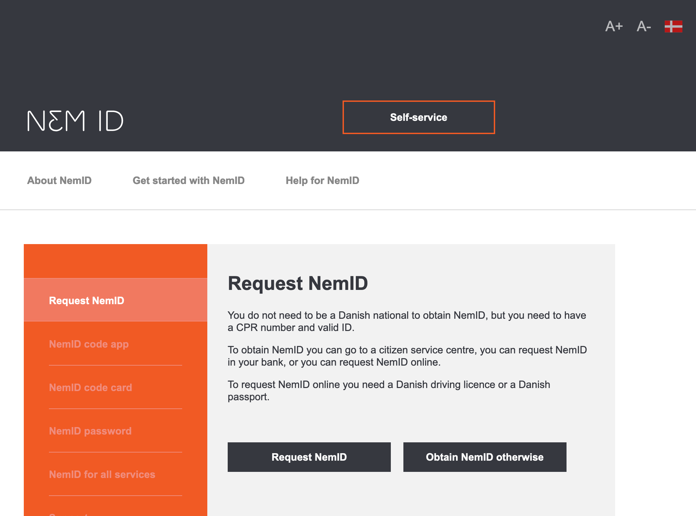
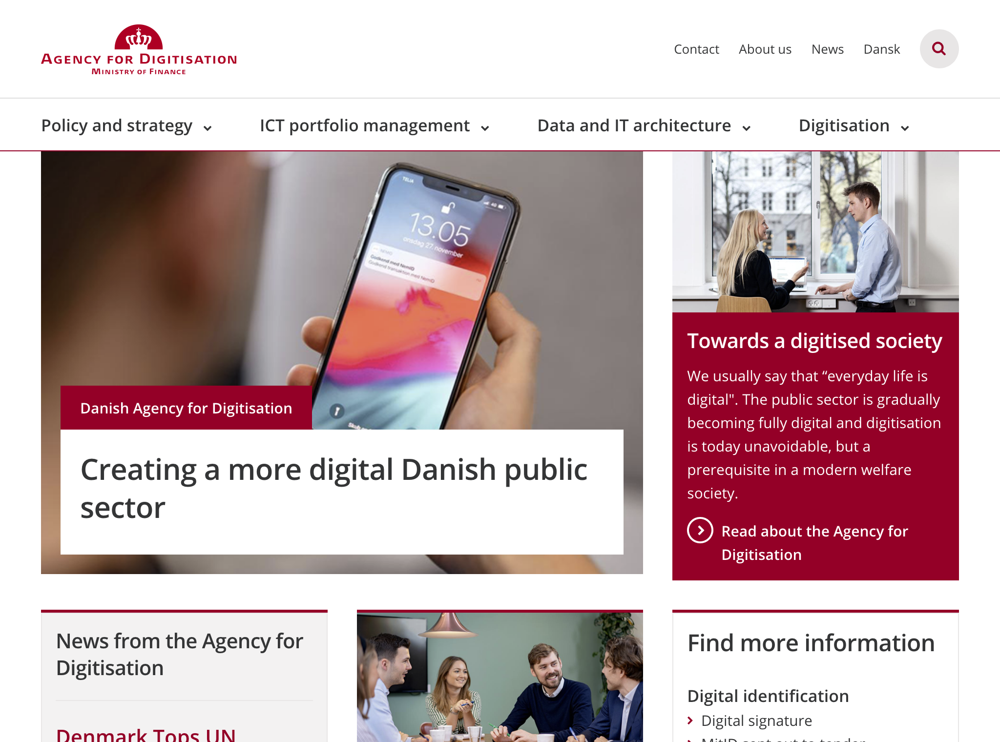
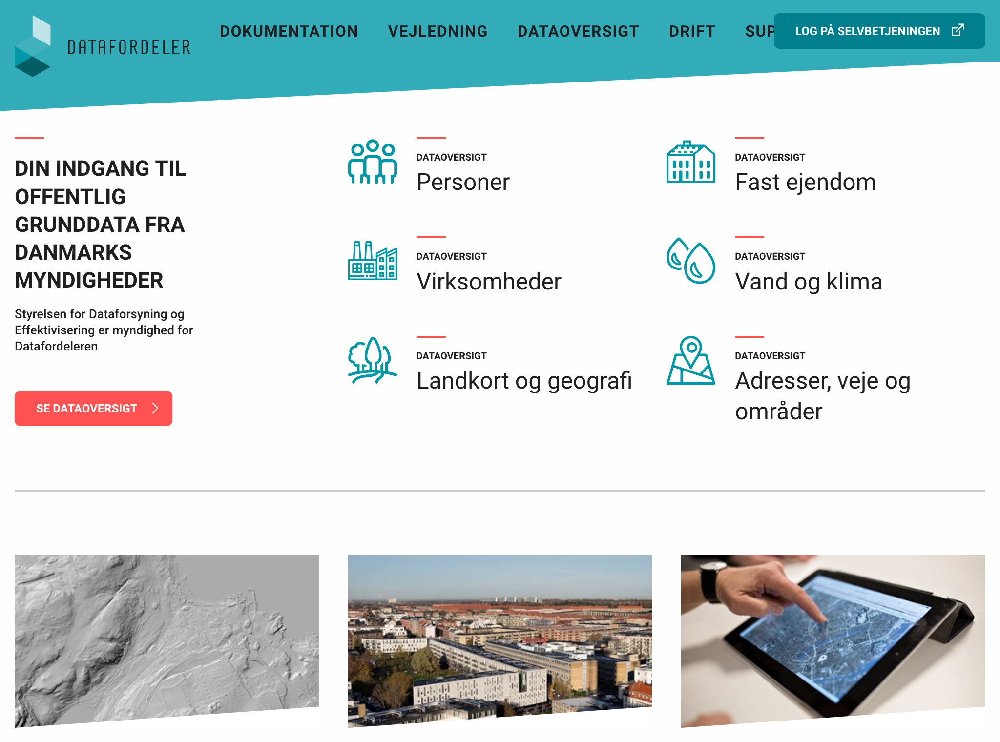

# Danemark

**Attention : ces informations sont parfois issues d'une traduction automatique des sites. Des erreurs d'interprétation ne peuvent pas être totalement écartées.**

## Identité Numérique pour les citoyens
Le service [NemID](https://www.nemid.nu/dk-en/) est le service de vérification d'identité pour les citoyens.

## Règles ou bonnes pratiques de construction de services numériques
### Conception des services - Accessibilité - UX
[L'agence digitale danoise](https://en.digst.dk/), intégrée au ministère des finances, donne les bonnes pratiques de conception de service publics numériques, tant en terme de parcours utilisateur, de techniques ou d'accessibilité.

### Doctrine sur les données connues de l'administration, exposition et habilitations

[L'agence danoise pour l'accès et l'efficacité des données](https://eng.sdfe.dk/) présente la doctrine de partage des données. Elle est responsable de la production et de la mise à disposition des données dans une liste de secteurs précis (données de géographies, données de population, etc.)

L'agence opère le service [Dataforeler](https://datafordeler.dk/) qui expose toutes les données de l'administration. Ce service s'adressent aux citoyens, entreprises privées et à l'administration et gère également les habilitations : les donneés sont accessible via l'identification nemID qui régit les droits de chaque utilisateur. 

## Données ouvertes
cf paragraphe précédent

## Cibles adressées par les produits
Tous utilisateurs, en fonction de leur droits.

## Inclusion & support
Sites essentiellement en disponibles en danois ; nemID est disponible en anglais.
Formulaire de contact, centre d'appel et lieu physique.

## Identité graphique et aspect général
Il n'y a pas de cohérence stricte entre les services.
Quasiment aucune iconographie. 

## Schéma de l'écosystème
Légende du tableau : 
- Identité Numérique pour les citoyens :bust_in_silhouette:
- Règles ou bonnes pratiques de construction de services numériques :beginner:
- Exposition & habilitations pour les données :closed_lock_with_key:
- Données ouvertes :unlock:
- Sécurité et tech :bomb:
- Pilotage et plan de transformation :dart:

| Nom du service    |  Feature |  Cible | Capture | 
|-------------------|---|---|---|
| [NemID](https://www.nemid.nu/dk-en/) | :bust_in_silhouette: | Citoyens et professionnels  |   |
| [L'agence digitale danoise](https://en.digst.dk/)            | :beginner: |  Agents publics |    |
| [L'agence danoise pour l'accès et l'efficacité des données](https://eng.sdfe.dk/)      | :dart:  | Tous  |  |
| [Dataforeler](https://datafordeler.dk/)        |  :unlock: :closed_lock_with_key: | Tous  | |
* * *
